# Taj Mahal Express — Phase 2: Database Schema

> Migration file: `/supabase/migrations/0001_initial_schema.sql`

---

## Table Inventory (32 tables)

| # | Table | Soft Delete | RLS | Notes |
|---|-------|------------|-----|-------|
| 1 | `users` | — | ✅ | Mirror of `auth.users`; auto-synced via trigger |
| 2 | `categories` | — | ✅ | Self-referencing tree; level + path columns |
| 3 | `addresses` | `deleted_at` | ✅ | Shared by buyers and sellers |
| 4 | `coupons` | — | ✅ | Platform-wide or seller/category-scoped |
| 5 | `seller_profiles` | `deleted_at` | ✅ | KYC status gate; bank fields encrypted at app layer |
| 6 | `buyer_profiles` | — | ✅ | Extended buyer info |
| 7 | `kyc_documents` | — | ✅ | Document uploads; admin-reviewed |
| 8 | `products` | `deleted_at` | ✅ | FTS via `search_vector`; trgm index on title |
| 9 | `product_price_history` | — | ✅ | Auto-appended on variant price change |
| 10 | `product_variants` | — | ✅ | SKU + options jsonb; triggers price history |
| 11 | `product_images` | — | ✅ | Up to 8 per product |
| 12 | `inventory` | — | ✅ | Per-variant; reserved qty tracks live orders |
| 13 | `carts` | — | ✅ | One per user (auth) or session_id (guest) |
| 14 | `cart_items` | — | ✅ | Price snapshot on add |
| 15 | `orders` | — | ✅ | Platform-level order; split into order_items per seller |
| 16 | `order_items` | — | ✅ | Snapshots of product/variant at purchase time |
| 17 | `payments` | — | ✅ | Razorpay order + payment IDs; idempotency key |
| 18 | `shipments` | — | ✅ | One per seller-group within an order |
| 19 | `shipment_events` | — | ✅ | Courier scan events; append-only |
| 20 | `shipment_items` | — | ✅ | Junction: shipment ↔ order_items |
| 21 | `reviews` | `deleted_at` | ✅ | One per `order_item_id`; verified-purchase only |
| 22 | `review_votes` | — | ✅ | Helpful / not-helpful; updates review counts |
| 23 | `wishlists` | — | ✅ | Simple buyer-product-variant bookmark |
| 24 | `coupon_redemptions` | — | ✅ | One per order; increments coupon.current_uses |
| 25 | `disputes` | — | ✅ | SLA deadlines computed at insert |
| 26 | `dispute_messages` | — | ✅ | Thread; `is_internal` hides admin notes from parties |
| 27 | `refunds` | — | ✅ | Razorpay refund API result stored |
| 28 | `seller_payouts` | — | ✅ | Weekly batch header |
| 29 | `payout_line_items` | — | ✅ | One row per settled order_item |
| 30 | `admin_logs` | — | ✅ | Immutable; no UPDATE/DELETE policies |
| 31 | `fraud_signals` | — | ✅ | Admin-only visibility |
| 32 | `notifications` | — | ✅ | Multi-channel; in_app default |

---

## Key Design Decisions

| Decision | Choice | Trade-off |
|----------|--------|-----------|
| PK type | `uuid` via `gen_random_uuid()` | No sequential enumeration in URLs; slight index bloat vs bigserial |
| Money type | `numeric(12,2)` | Exact arithmetic; no float rounding; standard for financial data |
| Text | `text` (not `varchar`) | Postgres stores them identically; `varchar(n)` adds overhead with no benefit |
| Timestamps | `timestamptz` | Stores in UTC; converts to IST at display layer — safe for global infra |
| Product snapshots | Copied to `order_items` | Survives product edits/deletes; denormalised by design |
| Role authority | `auth.users.app_metadata` | JWT-native; not user-editable unlike `user_metadata`; flows into RLS via `auth.jwt()` |
| Search | `tsvector` + `pg_trgm` | Full-text for relevance ranking; trigram for typo tolerance — both in-DB, no Elasticsearch needed for MVP |
| Inventory tracking | `quantity` + `reserved_quantity` | Separate columns prevent oversell under concurrent orders |
| Payout computation | Function `compute_seller_payout()` | Returns only unsettled delivered items not in any `payout_line_items` row; idempotent |
| ON DELETE behavior | RESTRICT on financial tables | Prevents accidental cascade deletion of orders/payments/refunds |

---

## ER Diagram (Core entities)

```mermaid
erDiagram

  auth_users {
    uuid id PK
    text email
    text phone
    jsonb raw_app_meta_data
  }

  users {
    uuid id PK
    text email
    text phone
    text full_name
    text role
    bool is_active
  }

  seller_profiles {
    uuid id PK
    uuid user_id FK
    text business_name
    text gstin
    text kyc_status
    bool is_active
    numeric commission_rate
  }

  buyer_profiles {
    uuid id PK
    uuid user_id FK
    uuid default_address_id FK
    text language_preference
  }

  kyc_documents {
    uuid id PK
    uuid seller_id FK
    text document_type
    text verification_status
  }

  categories {
    uuid id PK
    uuid parent_id FK
    text name
    text slug
    int  level
    text path
  }

  products {
    uuid id PK
    uuid seller_id FK
    uuid category_id FK
    text title
    text status
    numeric base_price
    numeric mrp
    numeric gst_rate
    int  review_count
    numeric average_rating
    tsvector search_vector
  }

  product_variants {
    uuid id PK
    uuid product_id FK
    text sku
    text title
    jsonb options
    numeric price
    numeric mrp
  }

  product_images {
    uuid id PK
    uuid product_id FK
    uuid variant_id FK
    text url
    bool is_primary
  }

  inventory {
    uuid id PK
    uuid variant_id FK
    int quantity
    int reserved_quantity
    int low_stock_threshold
  }

  product_price_history {
    uuid id PK
    uuid product_id FK
    uuid variant_id FK
    numeric price
    numeric mrp
    timestamptz recorded_at
  }

  addresses {
    uuid id PK
    uuid user_id FK
    text full_name
    text pincode
    text city
    text state
    bool is_default
  }

  carts {
    uuid id PK
    uuid user_id FK
    text session_id
  }

  cart_items {
    uuid id PK
    uuid cart_id FK
    uuid variant_id FK
    int quantity
    numeric price_snapshot
  }

  coupons {
    uuid id PK
    text code
    text type
    numeric value
    int max_uses
    int current_uses
    timestamptz expires_at
  }

  orders {
    uuid id PK
    text order_number
    uuid buyer_id FK
    uuid shipping_address_id FK
    uuid coupon_id FK
    text status
    numeric grand_total
    text payment_status
  }

  order_items {
    uuid id PK
    uuid order_id FK
    uuid seller_id FK
    uuid product_id FK
    uuid variant_id FK
    text product_title
    int quantity
    numeric unit_price
    numeric commission_rate
    numeric seller_payout_amount
    text item_status
  }

  payments {
    uuid id PK
    uuid order_id FK
    text razorpay_order_id
    text razorpay_payment_id
    numeric amount
    text status
    text idempotency_key
  }

  shipments {
    uuid id PK
    uuid order_id FK
    uuid seller_id FK
    text awb_number
    text courier_name
    text status
  }

  shipment_events {
    uuid id PK
    uuid shipment_id FK
    text status
    text description
    timestamptz occurred_at
  }

  reviews {
    uuid id PK
    uuid product_id FK
    uuid order_item_id FK
    uuid buyer_id FK
    int rating
    bool is_approved
    int helpful_count
  }

  disputes {
    uuid id PK
    uuid order_item_id FK
    uuid buyer_id FK
    uuid seller_id FK
    text reason
    text status
    text resolution_type
    timestamptz sla_deadline
    timestamptz final_deadline
  }

  dispute_messages {
    uuid id PK
    uuid dispute_id FK
    uuid sender_id FK
    text sender_role
    bool is_internal
  }

  refunds {
    uuid id PK
    uuid order_id FK
    uuid payment_id FK
    uuid dispute_id FK
    text razorpay_refund_id
    numeric amount
    text status
  }

  seller_payouts {
    uuid id PK
    uuid seller_id FK
    date period_start
    date period_end
    numeric gross_amount
    numeric net_amount
    text status
  }

  payout_line_items {
    uuid id PK
    uuid payout_id FK
    uuid order_item_id FK
    numeric gross_amount
    numeric commission_amount
    numeric net_amount
  }

  admin_logs {
    uuid id PK
    uuid actor_id FK
    text action
    text target_type
    uuid target_id
    jsonb before_state
    jsonb after_state
  }

  fraud_signals {
    uuid id PK
    uuid user_id FK
    uuid seller_id FK
    uuid order_id FK
    text signal_type
    text severity
    text status
  }

  notifications {
    uuid id PK
    uuid user_id FK
    text type
    text channel
    bool is_read
  }

  wishlists {
    uuid id PK
    uuid buyer_id FK
    uuid product_id FK
  }

  %% Relationships
  auth_users         ||--|| users               : "synced via trigger"
  users              ||--o| seller_profiles      : "has"
  users              ||--o| buyer_profiles       : "has"
  users              ||--o{ addresses            : "owns"
  seller_profiles    ||--o{ kyc_documents        : "submits"
  seller_profiles    ||--o{ products             : "lists"
  categories         ||--o{ categories           : "parent_id"
  categories         ||--o{ products             : "classified in"
  products           ||--o{ product_variants     : "has"
  products           ||--o{ product_images       : "has"
  products           ||--o{ product_price_history: "logs"
  product_variants   ||--|| inventory            : "tracked by"
  product_variants   ||--o{ product_price_history: "logs"
  users              ||--o| carts                : "has"
  carts              ||--o{ cart_items           : "contains"
  product_variants   ||--o{ cart_items           : "referenced by"
  users              ||--o{ orders               : "places"
  addresses          ||--o{ orders               : "ships to"
  coupons            ||--o{ orders               : "applied to"
  orders             ||--o{ order_items          : "split into"
  seller_profiles    ||--o{ order_items          : "fulfils"
  orders             ||--|| payments             : "paid via"
  orders             ||--o{ shipments            : "shipped via"
  seller_profiles    ||--o{ shipments            : "creates"
  shipments          ||--o{ shipment_events      : "tracks"
  order_items        ||--o| reviews              : "reviewed as"
  users              ||--o{ reviews              : "writes"
  reviews            ||--o{ review_votes         : "voted on"
  order_items        ||--o| disputes             : "disputed via"
  disputes           ||--o{ dispute_messages     : "threads"
  disputes           ||--o{ refunds              : "triggers"
  payments           ||--o{ refunds              : "refunded from"
  seller_profiles    ||--o{ seller_payouts       : "receives"
  seller_payouts     ||--o{ payout_line_items    : "itemised as"
  order_items        ||--o{ payout_line_items    : "settled in"
  users              ||--o{ admin_logs           : "actor"
  users              ||--o{ fraud_signals        : "flagged"
  seller_profiles    ||--o{ fraud_signals        : "flagged"
  users              ||--o{ notifications        : "receives"
  users              ||--o{ wishlists            : "saves"
  products           ||--o{ wishlists            : "saved in"
```

---

## RLS Summary

| Role | Can read | Can write |
|------|----------|-----------|
| **Anonymous** | Active products, categories, approved reviews, active coupons, public seller profiles, shipment tracking (token) | — |
| **Buyer** | Own orders, cart, addresses, wishlist, disputes, notifications, payments | Place orders, manage cart/wishlist/addresses, submit reviews, open disputes |
| **Seller** | Own products, inventory, order_items (own), shipments (own), payouts, disputes (own) | Manage products, create shipments, send dispute messages |
| **Admin** | All tables | All tables (write to admin_logs for every action) |
| **Super Admin** | All tables | All tables + role assignments via `app_metadata` |

> Role is stored in `auth.users.app_metadata.role`, propagated into JWT, and read via `auth.jwt() -> 'app_metadata' ->> 'role'` in every policy. Application code never trusts `user_metadata` (user-editable) for authorization decisions.

---

## Functions Summary

| Function | Signature | Returns | Purpose |
|----------|-----------|---------|---------|
| `generate_order_number()` | `()` | `text` | `TME260512000001` format; sequence-backed; IST date |
| `calculate_order_total()` | `(order_id uuid)` | `TABLE(subtotal, shipping, discount, tax, grand_total)` | Live recalc; excludes cancelled items |
| `update_inventory_on_order()` | trigger | — | Reserves on INSERT; decrements on delivered; releases on cancel |
| `compute_seller_payout()` | `(seller_id, period_start, period_end)` | `TABLE(order_item rows)` | Returns unsettled delivered items; idempotent — skips already-paid |

---

*End of Phase 2 — Database Schema*

*Next phase: Security Architecture → `/docs/03-security.md`*
